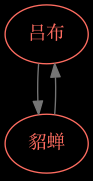
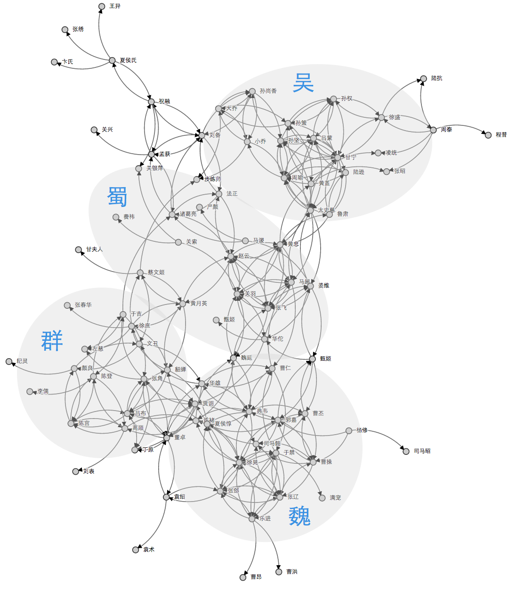

## 这是啥

试图发现三国人物之间的依赖关系——扯淡——这是手游《放开那三国》武将羁绊的关系图。

## 什么是武将羁绊

游戏中上阵只能是主角+五个三国人物，为了让游戏内容更加丰富，设定当人物之间符合特定关系时，能激发出攻击加强、防御加强、生命值增加等特效。

比如，凑齐了`吕布`+`貂蝉`，就会触发`英雄美人：吕布和貂蝉同时上场，攻击+27%`的羁绊特效。

双方都得到加强，是极好的。

但是很多时候羁绊是单向的：如`关羽`能够为`关索`增加`荆州认父：攻击+23%`的效果，但是`关索`上场不能增益`关羽`的属性——大概是`领袖光环`吧。

而且，游戏策划为了让事情更复杂，还有群体羁绊，如`五虎上将（关羽、张飞、赵云、马超、黄忠）同时上场，攻击+32%，生命+32%`。

## 怎么实现

将武将当做模块，用requirejs描述模块关系，madge形成模块依赖图。

## 为什么要搞这么个东西

因为蛋疼。

这一套体系在手游中非常流行，`我叫MT`中称为`组合`，`暴走武侠`中称为`缘分`，实质都是一样的。我想定量看看这些策划是怎么想的。

## 大概是个啥效果

